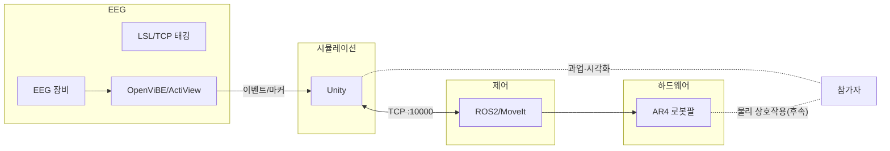

---
layout: center
class: text-center
---

# 신뢰·작업부하 인지형 HRI 플랫폼
뇌와 로봇을 실시간으로 잇는 실험 기반 플랫폼

고광채

HCN Lab · 인천대학교 임베디드시스템공학과

2025-09-15

---

# 목차
- 연구 배경 · 문제정의
- 연구 목표 · 연구질문
- 시스템/실험 구성 (Unity–ROS2–EEG)
- 과업/프로토콜 (pick-and-place: 정상/오류)
- 진행 상황 · 데모
- 분석 계획 (바이오마커/전처리)
- 리스크 · 다음 단계
---

# 문제정의

<v-clicks>

AR4 Stack을 바탕으로 “EEG 바이오마커를 활용한 HRI 작업부하·신뢰 평가” 실험 환경을 구축·확장

## 해결하려는 문제

- 모니터 기반 상호작용 중심의 기존 HRI를 VR/AR 및 실제 물리 환경으로 확장
- 작업 중 인지 상태(작업부하·신뢰)를 정량화할 객관 지표 부족
- 시뮬레이션–하드웨어–EEG 파이프라인의 분절로 재현성·확장성 저하

## 제공하는 가치
- Unity–ROS2 위에 EEG(LSL/OpenViBE) 동기화 계층 추가
- pick-and-place 과업에서 정상/오류의 EEG 차이 제시(예: theta 파워, ERP)
- 신경인간공학 관점의 HRI 평가 프레임으로 재사용 가능
</v-clicks>

---

# 연구 배경 · 접근 방식 선택

<v-clicks>

## 왜 이 연구를 하는가?
- **Physical AI 시대**: 로봇이 실제 환경에서 작업 → HRI 평가의 객관성 필요
- **기존 한계**: 주관적 설문 중심 평가로는 실시간/정량적 신뢰·작업부하 측정 어려움
- **EEG의 가능성**: 뇌파는 인지 상태를 실시간으로 반영하는 객관적 바이오마커

## 왜 이런 접근법을 택했는가?
- **시뮬→실제 전략**: 안전하고 통제된 환경에서 검증 후 물리 환경 확장
- **pick-and-place 선택**: 가장 기본적이면서도 오류 상황 유도 가능한 과업
- **통합 플랫폼**: Unity-ROS2-EEG 동기화로 재현 가능한 실험 환경 구축

## 기대하는 기여
- 실시간 신경인간공학적 HRI 평가 방법론 제시
- 시뮬레이션과 물리 환경 간 EEG 반응 차이 규명

</v-clicks>

---

# 연구 목표 · 연구질문

<v-clicks>

## 한 줄 목표
뇌와 로봇을 실시간으로 잇는, 신뢰·작업부하 인지형 HRI 플랫폼

## 구체 목표
- pick-and-place 과업에서 정상 vs 오류 상황의 EEG 차이 검증
- 검증된 바이오마커(예: theta 밴드 파워, ERP) 기반 분석 파이프라인 정립
- 유사 로봇팔 과업에 일반화 가능한 HRI 평가 방법론 제시

## 연구질문 (예시)

- RQ1: pick-and-place 과업에서 오류 vs 정상 조건 간 EEG 바이오마커 차이는 유의한가?
- RQ2: 신뢰 조작(피드백/오류 빈도)이 EEG 지표(예: frontal theta, ERP)에 미치는 영향은 무엇인가?
</v-clicks>

---

# 시스템/실험 구성 (Unity–ROS2–EEG)

---

# 기술적 선택의 근거

<v-clicks>

## 플랫폼 선택 배경
- **Unity**: EEG 장비 연결 편의성, VR/AR 환경 구축 용이성, 가상환경 시각화 강점
- **ROS2**: 현재 표준 로봇 플랫폼, 하드웨어 연결 필수, 실시간 제어 지원
- **LSL/OpenViBE**: 보유 EEG 장비와 호환, 이벤트 마커 동기화 편의성
- **AR4**: 예산(~300만원) 내 최적 성능/페이로드 비율

## 개발 환경 선택
- **WSL2 채택**: Unity(Windows) + ROS2(Linux) 단일 머신 구동 필요
- **시뮬 우선 전략**: 하드웨어 부품 지연 + Unity/ROS2 학습 곡선 고려

</v-clicks>

---

# 과업/패러다임 (pick-and-place)

<v-clicks>

## 과업 단계
- 준비 → reach → grasp → lift → place → 피드백
- 오류 주입: 미세 위치/자세 오류, 그립 실패, 충돌 회피 경로 변경 등

## 조건/마커 설계
- 조건: 정상 vs 오류, 신뢰 수준(피드백 정확도) 조작
- 마커: 준비/reach/grasp/lift/place/피드백/오류
- 동기화: Unity→LSL 태깅, ROS 타임 병행 기록
</v-clicks>

---

# 진행 상황 · 구현 과정

<v-clicks>

## 현재 위치와 경과
- **현재 단계**: 시뮬레이션 환경 구축 완료, 하드웨어 연결 준비 중
- **학습 곡선**: Unity + ROS2 모두 처음 사용으로 환경 파악에 상당 시간 소요
- **부품 이슈**: 일부 AR4 부품 불량으로 교체 대기 중 → 시뮬 우선 진행

## 주요 구현 성과
- Unity–ROS2 TCP 브리지 안정화 (포트 10000)
- MoveIt 경로 계획과 Unity 시각화 동기화
- 기본 pick-and-place 시퀀스 구현

## 다음 단계로 가는 이유
- 시뮬 환경에서 EEG 마커 동기화 검증 필요
- 하드웨어 안전성 확보 후 물리 환경 확장 예정

</v-clicks>

---

# 데모 사진

  <v-clicks></v-clicks>
  <v-clicks></v-clicks>

---

# 데모 영상
<video controls width="800" class="rounded shadow">
  <source src="/videos/ar4_moveit_unity_sim.mp4" type="video/mp4">
  Your browser does not support the video tag.
  <a href="/videos/ar4_moveit_unity_sim.mp4">Download video</a>
</video>
---

# 리스크와 대응

<v-clicks>

## 주요 리스크
- WSL2 네트워킹/USB 이슈로 연결 불안정
- Unity/패키지 버전 변동에 따른 파손
- 문서와 구현의 드리프트 발생
- 하드웨어 내구성/안전 이슈

## 대응 전략
- 검증된 버전 핀 고정, 재현 스크립트 제공
- 사전 점검 체크리스트, 대체 경로(시뮬 우선)
- 문서 CI 검사 및 분기 릴리스
- 안전 가이드·리미트·복구 시나리오 준비
</v-clicks>

---

# 다음 단계

<v-clicks>

## 바로 다음 단계
- 첫 모션 튜토리얼 초안 검토/촬영 범위 확정
- 하드웨어 조립(AR4) 진행 및 안전 체크리스트 작성

## 향후 계획(요약)
- VR(HMD) 도입 및 XR 상호작용 설계
- LSL/OpenViBE 마커 동기화 검증(LSL clock correction, ROS 타임 병행)
- 시뮬 → 실제 AR4 연동 리허설 및 위험요인 점검
</v-clicks>

---

# 하드웨어 부품 사진

<v-clicks></v-clicks>
<v-clicks></v-clicks>
<v-clicks></v-clicks>

---

# 하드웨어 조립 사진

<v-clicks></v-clicks>
<v-clicks></v-clicks>
<v-clicks></v-clicks>

---

# 참고 링크 (부록)
- 메인 저장소: https://github.com/kwangchae/ar4-stack
- ROS2 워크스페이스: https://github.com/kwangchae/ros2-ar4-ws
- Unity 시뮬레이션: https://github.com/kwangchae/unity-ar4-sim
- 버전 관리 정책: https://github.com/kwangchae/ar4-stack/blob/main/VERSIONING.md
---
layout: center
class: text-center
---

# 감사합니다! 🙏