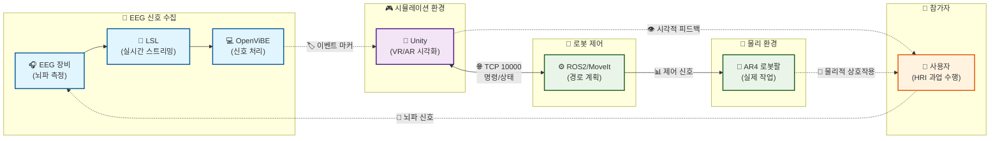

<link rel="stylesheet" href="style.css">

# EEG 바이오마커를 활용한 HRI 신뢰·작업부하 평가
뇌파 기반 실시간 로봇 상호작용 평가 플랫폼

고광채

HCN Lab · 인천대학교 임베디드시스템공학과

2025-09-15

---

# 목차
- 연구 배경·문제정의
- 연구목표·질문
- 연구 접근·아키텍처(시뮬 우선)
- 과업·프로토콜
- 기대기여·리스크
- 데모·다음단계
---

# 연구 배경·문제정의

<v-clicks>

AR4 Stack을 바탕으로 "EEG 바이오마커를 활용한 HRI 신뢰·작업부하 평가" 실험 환경을 구축·확장

## 해결하려는 문제

- 모니터 기반 상호작용 중심의 기존 HRI를 VR/AR 및 실제 물리 환경으로 확장
- 작업 중 인지 상태(신뢰·작업부하)를 정량화할 객관 지표 부족
- 시뮬레이션–하드웨어–EEG 파이프라인의 분절로 재현성·확장성 저하

## 제공하는 가치
- Unity–ROS2 위에 EEG(LSL/OpenViBE) 동기화 계층 추가
- pick-and-place 과업에서 정상/오류의 EEG 차이 제시(예: theta 파워, ERP)
- 신경인간공학 관점의 HRI 평가 프레임으로 재사용 가능
</v-clicks>

---

# 연구 목표

<v-clicks>

## 🎯 한 줄 목표
EEG 바이오마커로 HRI 신뢰·작업부하를 실시간 정량화하는 평가 플랫폼

## 📋 구체적 연구 목표

### 1️⃣ EEG 바이오마커 검증
- pick-and-place 과업에서 정상 vs 오류 뇌파 차이 규명
- 신뢰성 있는 신경생리학적 지표 확립

### 2️⃣ 실시간 분석 파이프라인
- theta 파워, ERP 중심 분석 알고리즘 구축
- 실시간 처리 가능한 전처리 시스템

### 3️⃣ HRI 평가 방법론
- 로봇팔 과업 **일반화 가능한** 평가 프레임워크
- 주관적 평가 보완하는 객관적 신경지표

### 4️⃣ 통합 플랫폼 완성
- Unity-ROS2-EEG **삼각 동기화** 시스템
- 다양한 HRI 시나리오 적용 가능한 **범용 도구**

</v-clicks>

---

# 핵심 연구질문

<v-clicks>

## ❓ 주요 연구질문

### RQ1: 과업 수행 중 뇌파 차이 🧠
pick-and-place 과업에서 오류 vs 정상 조건 간 EEG 바이오마커의 차이는 유의한가?

**🔬 가설**: 오류 상황에서 frontal theta 파워 증가, 특정 ERP 컴포넌트 변화

### RQ2: 신뢰 조작의 신경 반응 ⚖️
신뢰 조작(피드백/오류 빈도)이 frontal theta, ERP에 미치는 영향은?

**🔬 가설**: 낮은 신뢰 조건에서 인지 부하 증가 반영

### RQ3: 환경 간 반응 차이 🌐
시뮬레이션과 실제 환경에서 EEG 반응 패턴의 차이는?

**🔬 가설**: 물리 환경에서 더 강한 각성 및 주의 반응

</v-clicks>

---

# 연구 접근 전략

<v-clicks>

## 연구 접근법의 핵심 아이디어

### 🔬 실험적 접근
- **객관적 측정**: 주관적 설문 → 객관적 뇌파 지표
- **실시간 평가**: 과업 수행 중 즉시 신경 반응 측정
- **정량적 분석**: 통계적 유의성 검증 가능한 데이터

### 🔄 순차적 확장 전략
- **1단계**: 시뮬레이션 환경에서 안전한 검증
- **2단계**: 물리 로봇으로 점진적 확장
- **3단계**: VR/AR 몰입형 환경으로 발전

### 🎯 과업 중심 설계
- **기본 과업**: pick-and-place로 시작
- **오류 시나리오**: 다양한 실패 상황 구성
- **일반화**: 복잡한 HRI 과업으로 확장

</v-clicks>

---

# 시뮬레이션 우선 전략

<v-clicks>

## 왜 시뮬레이션부터 시작하는가?

### 🛡️ 안전성 확보
- **위험 최소화**: 물리적 충돌이나 손상 없음
- **반복 실험**: 동일 조건에서 무제한 반복 가능
- **빠른 검증**: 하드웨어 제약 없이 알고리즘 검증

### 🔬 통제된 실험 환경
- **변수 제어**: 정확한 독립변수 조작 가능
- **재현성**: 완전히 동일한 조건 재현
- **데이터 품질**: 노이즈 최소화된 깨끗한 데이터

### ⚡ 개발 효율성
- **빠른 프로토타이핑**: 즉시 테스트 가능
- **비용 절약**: 하드웨어 마모나 손상 없음
- **병렬 개발**: 하드웨어 준비와 독립적으로 진행

</v-clicks>

---

# 시스템 아키텍처

---

# 플랫폼 선택 근거: Unity & ROS2

<v-clicks>

## 🎮 Unity
- **EEG 통합**: LSL 네이티브 지원으로 뇌파 데이터 실시간 처리
- **3D 시각화**: 직관적인 로봇 동작 표현
- **VR/AR 확장**: 향후 몰입형 환경 구축 가능

## 🤖 ROS2
- **로보틱스 표준**: 업계 표준 플랫폼
- **MoveIt 2**: 모션 플래닝 및 제어
- **실시간 성능**: 하드웨어 제어 최적화

## 🔗 통합 환경
- **WSL2**: Unity(Windows) + ROS2(Linux) 단일 머신 실행
- **실시간 동기화**: Unity ↔ ROS2 ↔ EEG 연결

</v-clicks>

---

# 실험 장치(하드웨어)

<v-clicks>

## 🧠 EEG 시스템
- **장비**: BIOSEMI
- **채널**: 16채널, 1000Hz
- **전극**: 10-20 국제 표준 배치

## 🤖 로봇 시스템
- **모델**: AR4 6-DOF 로봇팔
- **페이로드**: 2.5kg
- **작업반경**: 660mm

</v-clicks>

---

# 실험 소프트웨어

<v-clicks>

## 💻 핵심 소프트웨어
- **Unity**: 시뮬레이션 및 시각화
- **ROS2**: 로봇 제어 및 모션 플래닝
- **OpenViBE**: EEG 신호 처리
- **WSL2**: 통합 개발 환경

## 🔄 시스템 연결
- **Unity ↔ ROS2**: TCP 통신
- **EEG ↔ Unity**: LSL 스트리밍
- **실시간 동기화**: 이벤트 마커 기반

</v-clicks>

---

# 과업·프로토콜 개요

  

    <h3>🎯 과업 선택 근거</h3>
    <h4>왜 pick-and-place인가?</h4>
    <v-clicks>
      <ul>
        <li><strong>🔧 기본성</strong>: 로봇 조작의 가장 기초적 과업</li>
        <li><strong>📊 분해성</strong>: 단계별 뇌파 분석 가능</li>
        <li><strong>⚠️ 오류 유도</strong>: 다양한 실패 시나리오 구성</li>
        <li><strong>🚀 확장성</strong>: 복잡한 과업의 기본 구성요소</li>
      </ul>
    </v-clicks>
    <h4>과업의 장점</h4>
    <v-clicks>
      <ul>
        <li><strong>표준화</strong>: 로보틱스 벤치마크 과업</li>
        <li><strong>재현성</strong>: 동일 조건 반복 실험 가능</li>
        <li><strong>측정 용이성</strong>: 명확한 성공/실패 기준</li>
      </ul>
    </v-clicks>
  

  

    <h3>📋 과업 구성 요소</h3>
    <h4>물체 및 환경</h4>
    <v-clicks>
      <ul>
        <li><strong>목표 물체</strong>: 표준 큐브 (50×50×50mm)</li>
        <li><strong>시작 위치</strong>: 고정된 픽업 지점</li>
        <li><strong>목표 위치</strong>: 변동 가능한 플레이스 지점</li>
        <li><strong>장애물</strong>: 선택적 배치 (복잡도 조절)</li>
      </ul>
    </v-clicks>
    <h4>오류 시나리오(명시)</h4>
    <v-clicks>
      <ul>
        <li>미집기: 그립 실패/슬립 유도</li>
        <li>미플레이스: 목표 위치 오차 유발</li>
        <li>경로 교란: 장애물/외란으로 경로 변경</li>
        <li>속도 변조: 비정상적으로 느림/빠름</li>
        <li>의도적 잘못된 피드백: 긍/부 피드백을 의도적으로 오류화</li>
      </ul>
    </v-clicks>
  

---

# 연구 기대 기여

<v-clicks>

## 🏆 방법론적 기여

### 📊 새로운 평가 패러다임
- 실시간 신경인간공학적 HRI 평가 방법론 확립
- 주관적 설문 → 객관적 뇌파 지표 전환

### 🔬 정량화 기법 개발
- EEG 기반 신뢰·작업부하 정량화 기법 제시
- 실시간 처리 가능한 바이오마커 추출 알고리즘

## 🚀 실용적 기여

### 🗺️ 환경 매핑 연구
- 시뮬레이션↔물리 환경 간 EEG 반응 매핑
- **전이 학습** 가능성 탐색

### 📋 설계 가이드라인
- HRI 시스템 설계 시 활용 가능한 신경지표 가이드라인
- **적응적 HRI** 구현을 위한 실시간 피드백 시스템

</v-clicks>

---

# 연구 리스크·완화

<v-clicks>

## 주요 리스크
- WSL2 네트워킹/USB 이슈로 연결 불안정
- Unity/패키지 버전 변동에 따른 파손
- 문서와 구현의 드리프트 발생
- 하드웨어 내구성/안전 이슈

## 대응 전략
- 검증된 버전 핀 고정, 재현 스크립트 제공
- 사전 점검 체크리스트, 대체 경로(시뮬 우선)
- 문서 CI 검사 및 분기 릴리스
- 안전 가이드·리미트·복구 시나리오 준비
</v-clicks>

---

# 연구 진행 현황

<v-clicks>

## 현재 위치와 경과
- **현재 단계**: 시뮬레이션 환경 구축 완료, 하드웨어 연결 준비 중
- **학습 곡선**: Unity + ROS2 모두 처음 사용으로 환경 파악에 상당 시간 소요
- **부품 이슈**: 일부 AR4 부품 불량으로 교체 대기 중 → 시뮬 우선 진행

## 주요 구현 성과
- Unity–ROS2 TCP 브리지 안정화 (포트 10000)
- MoveIt 경로 계획과 Unity 시각화 동기화
- 기본 pick-and-place 시퀀스 구현

## 다음 단계로 가는 이유
- 시뮬 환경에서 EEG 마커 동기화 검증 필요
- 하드웨어 안전성 확보 후 물리 환경 확장 예정

</v-clicks>

---

# 데모 스냅샷

  <v-clicks></v-clicks>
  <v-clicks></v-clicks>

---

# 데모 영상
<video controls width="800" class="rounded shadow">
  <source src="/videos/ar4_moveit_unity_sim.mp4" type="video/mp4">
  Your browser does not support the video tag.
  <a href="/videos/ar4_moveit_unity_sim.mp4">Download video</a>
</video>
---

# 다음 단계(연구 계획)

<v-clicks>

## 바로 다음 단계
- 첫 모션 튜토리얼 초안 검토/촬영 범위 확정
- 하드웨어 조립(AR4) 진행 및 안전 체크리스트 작성

## 향후 계획(요약)
- VR(HMD) 도입 및 XR 상호작용 설계
- LSL/OpenViBE 마커 동기화 검증(LSL clock correction, ROS 타임 병행)
- 시뮬 → 실제 AR4 연동 리허설 및 위험요인 점검
</v-clicks>

---

# 하드웨어 부품 사진

<v-clicks></v-clicks>
<v-clicks></v-clicks>
<v-clicks></v-clicks>

---

# 하드웨어 조립 사진

<v-clicks></v-clicks>
<v-clicks></v-clicks>
<v-clicks></v-clicks>

---

# 참고 링크 (부록)
- 메인 저장소: https://github.com/kwangchae/ar4-stack
- ROS2 워크스페이스: https://github.com/kwangchae/ros2-ar4-ws
- Unity 시뮬레이션: https://github.com/kwangchae/unity-ar4-sim
- 버전 관리 정책: https://github.com/kwangchae/ar4-stack/blob/main/VERSIONING.md
---
layout: center
class: text-center
---

# 감사합니다! 🙏
