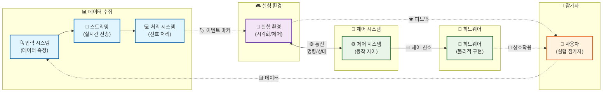

<link rel="stylesheet" href="/style.css">

# 메인 키워드를 활용한 연구 주제
핵심 방법론 기반 연구 목적

발표자명

소속 · 학과

YYYY-MM-DD

---

# 목차
- 연구 배경·문제정의
- 연구목표·질문
- 연구 접근·아키텍처
- 실험 설계·방법론
- 기대기여·한계
- 진행상황·다음단계
---

# 연구 배경·문제정의

<v-clicks>

기존 연구의 배경과 "핵심 키워드를 활용한 연구 주제" 설명

## 해결하려는 문제

- 문제점 1: 핵심 이슈 설명
- 문제점 2: 기존 방법의 한계
- 문제점 3: 연구 공백 또는 필요성

## 제공하는 가치
- 기술적 기여 설명
- 방법론적 기여 설명
- 학술적 기여 설명
</v-clicks>

---

# 연구 목표

<v-clicks>

## 🎯 한 줄 목표
핵심 방법론으로 연구 대상을 실시간 정량화하는 시스템

## 📋 구체적 연구 목표

### 1️⃣ 핵심 방법론 검증
- 구체적 목표 1 설명
- 신뢰성 있는 지표 확립

### 2️⃣ 실시간 분석 파이프라인
- 핵심 기술 중심 분석 알고리즘 구축
- 실시간 처리 가능한 전처리 시스템

### 3️⃣ 평가 방법론
- 일반화 가능한 평가 프레임워크
- 주관적 평가 보완하는 객관적 지표

### 4️⃣ 통합 플랫폼 완성
- 시스템 구성요소 동기화 시스템
- 다양한 시나리오 적용 가능한 범용 도구

</v-clicks>

---

# 핵심 연구질문

<v-clicks>

## ❓ 주요 연구질문

### RQ1: 주요 변수 간 차이 🧠
실험 조건에서 변수 A vs 변수 B 간 측정 지표의 차이는 유의한가?

**🔬 가설**: 조건 A에서 특정 지표 증가/감소 예상

### RQ2: 조작 변수의 영향 ⚖️
독립변수 조작이 종속변수에 미치는 영향은?

**🔬 가설**: 특정 조건에서 예상되는 반응

### RQ3: 환경 간 차이 🌐
환경 A와 환경 B에서 측정 지표의 차이는?

**🔬 가설**: 환경별 예상 차이점

</v-clicks>

---

# 연구 접근 전략

<v-clicks>

## 연구 접근법의 핵심 아이디어

### 🔬 실험적 접근
- **객관적 측정**: 주관적 방법 → 객관적 지표
- **실시간 평가**: 실험 중 즉시 측정
- **정량적 분석**: 통계적 유의성 검증 가능한 데이터

### 🔄 순차적 확장 전략
- **1단계**: 시뮬레이션/제어된 환경에서 검증
- **2단계**: 실제 환경으로 점진적 확장
- **3단계**: 복잡한 환경으로 발전

### 🎯 과업 중심 설계
- **기본 과업**: 단순한 과업으로 시작
- **복잡도 증가**: 점진적 복잡성 증가
- **일반화**: 다양한 과업으로 확장

</v-clicks>

---

# 시스템 아키텍처

---

# 실험 설계·방법론

  

    <h3>🎯 실험 설계</h3>
    <h4>독립변수</h4>
    <v-clicks>
      <ul>
        <li><strong>변수 1</strong>: 조작 내용</li>
        <li><strong>변수 2</strong>: 조작 내용</li>
        <li><strong>변수 3</strong>: 조작 내용</li>
      </ul>
    </v-clicks>
    <h4>종속변수</h4>
    <v-clicks>
      <ul>
        <li><strong>측정 지표 1</strong>: 측정 방법</li>
        <li><strong>측정 지표 2</strong>: 측정 방법</li>
        <li><strong>측정 지표 3</strong>: 측정 방법</li>
      </ul>
    </v-clicks>
  

  

    <h3>📋 실험 프로토콜</h3>
    <h4>참가자</h4>
    <v-clicks>
      <ul>
        <li><strong>표본 크기</strong>: N명</li>
        <li><strong>선정 기준</strong>: 포함/제외 기준</li>
        <li><strong>윤리 승인</strong>: IRB 승인 계획</li>
      </ul>
    </v-clicks>
    <h4>실험 절차</h4>
    <v-clicks>
      <ul>
        <li><strong>1단계</strong>: 사전 준비</li>
        <li><strong>2단계</strong>: 실험 진행</li>
        <li><strong>3단계</strong>: 사후 분석</li>
      </ul>
    </v-clicks>
  

---

# 기대 기여

<v-clicks>

## 🏆 방법론적 기여

### 📊 새로운 평가 패러다임
- 새로운 측정 방법 방법론 확립
- 기존 방법 → 개선된 방법 전환

### 🔬 정량화 기법 개발
- 핵심 기법 제시
- 실시간 처리 가능한 분석 알고리즘

## 🚀 실용적 기여

### 🗺️ 응용 가능성
- 다양한 분야 간 적용 가능성
- 확장성 및 일반화 가능성

### 📋 설계 가이드라인
- 관련 시스템 설계 시 활용 가능한 가이드라인
- 실무 적용을 위한 실시간 시스템

</v-clicks>

---

# 연구 리스크·완화

<v-clicks>

## 주요 리스크
- 기술적 리스크: 구체적 위험 요소
- 실험적 리스크: 데이터 수집 관련 위험
- 시간적 리스크: 일정 지연 가능성
- 자원 리스크: 예산/장비 관련 위험

## 대응 전략
- 기술적 대응: 대안 기술/방법 준비
- 실험적 대응: 백업 계획 수립
- 일정 관리: 단계별 마일스톤 설정
- 자원 관리: 효율적 자원 활용 계획
</v-clicks>

---

# 연구 진행 현황

<v-clicks>

## 현재 위치와 경과
- **현재 단계**: 구체적 진행 상황
- **완료 항목**: 이미 완료된 작업들
- **진행 중**: 현재 진행 중인 작업들

## 주요 성과
- 주요 성과 1: 구체적 결과
- 주요 성과 2: 달성된 목표
- 주요 성과 3: 검증된 내용

## 다음 단계 계획
- 단기 계획: 즉시 진행할 작업
- 중기 계획: 향후 몇 달 내 목표
- 장기 계획: 전체 연구 완성까지의 로드맵

</v-clicks>

---

# 데모 또는 결과

  <v-clicks></v-clicks>
  <v-clicks></v-clicks>

---

# 영상 데모 (선택사항)
<video controls width="800" class="rounded shadow">
  <source src="/videos/demo.mp4" type="video/mp4">
  Your browser does not support the video tag.
  <a href="/videos/demo.mp4">Download video</a>
</video>
---

# 다음 단계

<v-clicks>

## 바로 다음 단계
- 단기 목표 1: 구체적 계획
- 단기 목표 2: 실행 방안

## 향후 계획
- 중기 목표: 몇 달 내 달성 목표
- 장기 목표: 최종 연구 완성 계획
- 확장 계획: 후속 연구 아이디어

## 협력 및 지원 요청
- 필요한 지원: 구체적 도움 요청
- 협력 가능성: 타 연구실과의 협력

</v-clicks>

---

# 하드웨어 사진 (선택사항)

<v-clicks></v-clicks>
<v-clicks></v-clicks>
<v-clicks></v-clicks>

---

# 참고 문헌 (선택사항)
- 주요 참고문헌 1
- 주요 참고문헌 2
- 주요 참고문헌 3
- 관련 저장소: https://github.com/username/repository
---
layout: center
class: text-center
---

# 감사합니다! 🙏